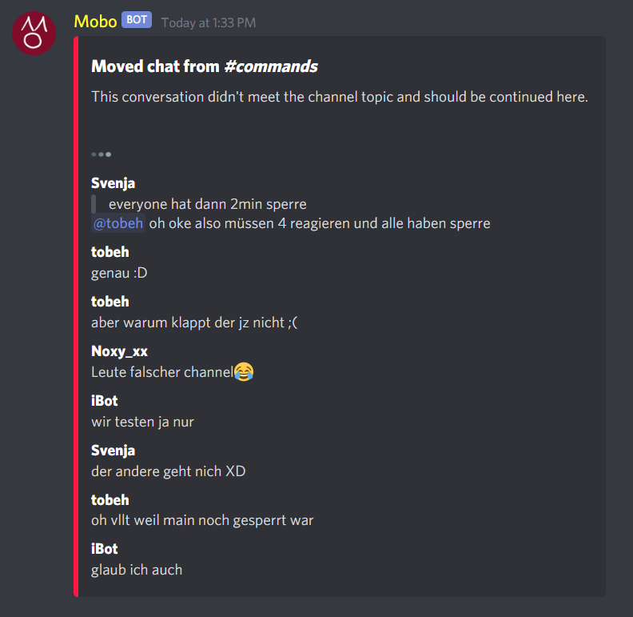
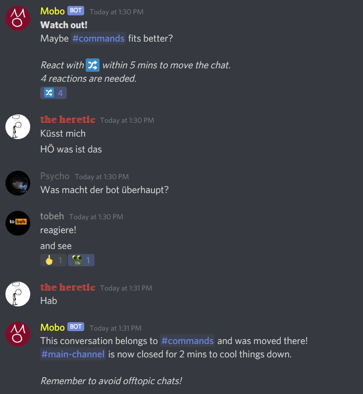

# Mobo - Discord Move Bot

Mobo is a simple-to-use bot which task is to get rid of offtopic spam in channels.
The problem with offtopic conversations is that the chat probably would stop when mods force to switch channel.

Mobo is your little friend to fix that.  
With the command mobo:move in the channel, mobo posts a message which tells users that this conversation is offtopic.  
Mobo will collect a amount of the last few messages (count is first parameter, eg 20) and creates an embed in a better fitting channel (second argument).
  
This has the effect that users can't spam anymore in the wrong channel, but on the other hand have the recent history in the right channel.  

Also, if there are no admins present, members who want to move the chat can use mobo:vote to vote for a chat move.  
Three votes in form of reactions will be needed.

## Screenshots
**Moved messages in the better fitting channel**  
  
 
---  
**Move votes**    
  

# Invite Mobo  
Get mobo here:    
https://discord.com/oauth2/authorize?client_id=745011440993304746&scope=bot&permissions=272408  
Ensure to grant the necessary permissions!

# Host Mobo
To host Mobo yourself, clone the repo and run the Mobo exe/dll in build.  
Latest dotnetcore is required.  
The first start parameter is the token, like:  
*dotnet Mobo.dll [token]*

# Commands

## Move chat
mobo:move [moved amount of messages] [target channel]  
Move chat as above described.

## Vote to move chat
mobo:vote [target channel]  
Mobo will write a message where members can react.  
If enough reactions are colected, the last 10 messages will be moved.  
The reactions have to be made within 5 minutes.  

## Show manual
mobo:manual   
Show the manual.  

## Say something
mobo:say [something]  
Useless command to make mobo cuter. Your command gets deleted.
Admins can react wit any emoji to reveal the author.

## Say something, but different  
mobo:pass [target channel] [something]  
Same as mobo:say, but echoes in another channel.  
Full anonymity since nobody sees you typing.  
