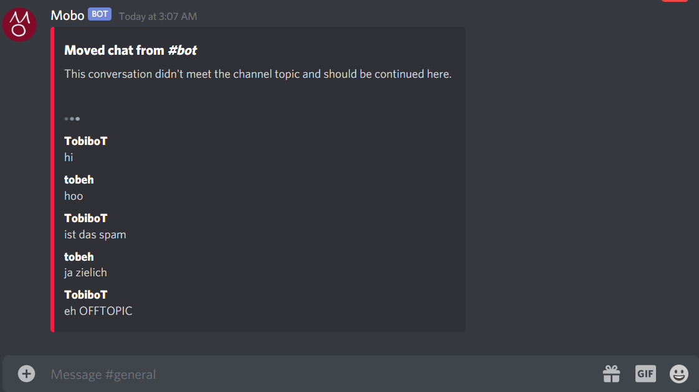

# Mobo - Discord Move Bot

Mobo is a simple-to-use bot which task is to get rid of offtopic spam in channels.
The problem with offtopic conversations is that the chat probably would stop when mods force to switch channel.

Mobo is your little friend to fix that.
With the command mobo:move in the channel, mobo posts a message which tells users that this conversation is offtopic.
The channel will then be read-only for the specified role (second argument; @everyone mostly makes sense).

Mobo will collect a amount of the last few messages (count is first parameter, eg 20) and creates an embed in a better fitting channel (third argument).

This has the effect, that users can't spam anymore in the wrong channel, but on the other hand have the recent history in the right channel.  
  

  
  

# Invite mobo
Get mobo here:  
https://discord.com/oauth2/authorize?client_id=745011440993304746&scope=bot&permissions=272408  
Ensure to grant the necessary permissions!

# Commands

## Move chat
mobo:move [moved amount of messages] [role to move] [target channel]

## Show manual
mobo:manual 

## Show warning
mobo:warn
